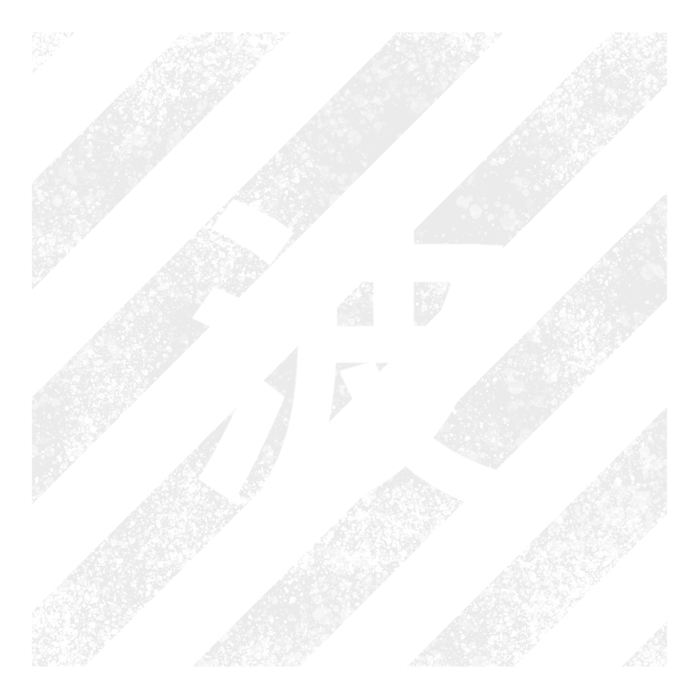

	 
	
> I'm a self-taugh full-stack developer-girl who dabbles in the arts of creativity occasionally 
> <i>Finding out what sticks since <code>integer_here</code>!</i>

<table>
	<tr></tr>
	<tr><td>

| INFO  ||
| :---: | :--- |
|        | <i>Running Arch Linux with KDE Plasma                                       </i> |
|  | <i>Currently learning Rust                                                  </i> |
|        | <i>[Contact me over Discord](https://discord.com/users/1133911326327066695) </i> |

</td><td>

| PROJECTS ||
| :---: | :--- |
|  <b><i>Featured</i></b>              | <a href="https://github.com/WaviestBalloon/ApplejuiceCLI">ApplejuiceCLI</a> <i>Roblox bootstrapper for Linux written in Rust</i> |
|  <b><i>Working on</i></b> | <i>Various projects</i>                                                                                                             |

</td></tr>
</table>

<h1> Software Stack</h1>

 

 

  

<a href="https://www.youtube.com/watch?v=qgU8vnRQbEg">:3</a> <a href="https://www.youtube.com/watch?v=6R0KuBEpjKg">X3</a>

