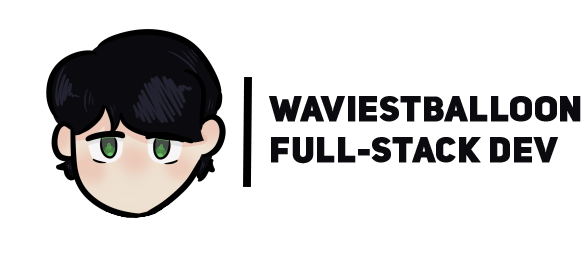
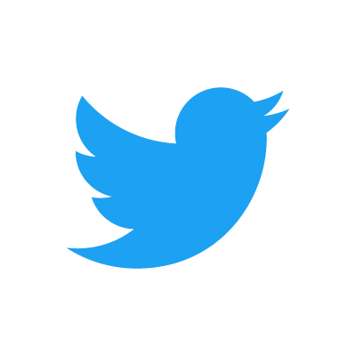

<!--
  Hello there, 
  If you want to fork this for your own profile, go ahead!
------------------------------------------------------------------
  To include your own Discord server widget, grab your server's ID and replace "772625019603386378" with your own ID
  There are 3 different banners, banner1, banner2 and banner3
  Then, get a non-expiring invite link and replace "pzZTMy5zAv" with your Discord invite
------------------------------------------------------------------
  Add images in the "resources" folder, you can get images or other assets by doing "./resources/"
------------------------------------------------------------------
  That's it, thank you!
-->

 

<strong>I'm a developer of Discordo, I do web-design and I love Node.JS 
Since I'm a full-stack developer, I do frontend and backend 
If you really want to, feel free to contact me on Discord and ask me for a website to be designed for you! 💙</strong>

 

  | <a href="https://buymeacoff.ee/WaviestBalloon"> BuyMeACoffee</a>

 <strong>WaviestBalloon#1961</strong>

<!--
 <strong>@WaviestBalloon</strong>
-->
